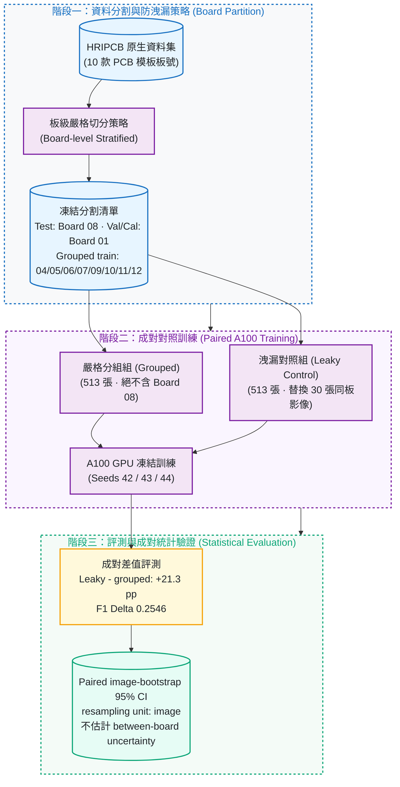
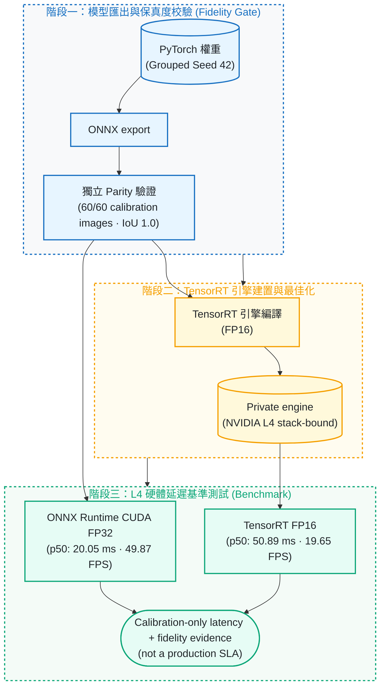

# pcb-defect-detection

[](https://github.com/kuotunyu/pcb-defect-detection/actions/workflows/ci.yml)


[](LICENSE)

本專案針對印刷電路板 (PCB) 瑕疵檢測場景，建立基於 **YOLO26n** 之嚴格板級資料防洩漏 (Board-level Leakage) 評測基準與多後端部署驗證管線：在 frozen paired protocol 下，針對單一 held-out Board 08 的 30 張 final-test images，觀察到 same-board sibling exposure 對應 `21.3` 個百分點的 mAP50 差距。此結果限於固定 dataset 與 training recipe，不估計 between-board 或 production generalization。專案另提供 ONNX fidelity/parity gate，以及 NVIDIA L4 上 PyTorch、ONNX Runtime CUDA 與 TensorRT 的 calibration-only 部署證據。

## 30 秒證據索引

| 招募者要核對的內容 | Committed evidence |
|---|---|
| Same-board exposure 的 paired effect（3 seeds、共同 final test） | [`reports/paired_a100/final_metrics.json`](reports/paired_a100/final_metrics.json) |
| Frozen split、board policy 與 dataset fingerprint | [`reports/protocol/paired_split_manifest.json`](reports/protocol/paired_split_manifest.json) |
| Hash-pinned ONNX fidelity 與 standalone parity gate | [`reports/paired_a100/deployment_gate.public.json`](reports/paired_a100/deployment_gate.public.json) |
| NVIDIA L4 三後端 latency、fidelity 與 provenance | [`reports/benchmark_l4.json`](reports/benchmark_l4.json) · [`reports/benchmark_l4.md`](reports/benchmark_l4.md) |

---

## 系統設計與關鍵特性

1. **嚴格板級防洩漏分割 (Board-level Stratified Partition)**：
   針對 HRIPCB 資料集按 PCB 實體模板板號 (Board ID) 進行嚴格物理隔離，杜絕同款板號跨入 Train/Test 所造成之特徵過度擬合與性能虛高。
2. **成對對照實驗架構 (Paired Protocol & A100 Benchmarking)**：
   固定相同的 30 張最終測試影像（單一 Board 08），對比「嚴格分組組 (Grouped)」與「洩漏對照組 (Leaky Control)」，在 3 個獨立種子 (Seeds 42/43/44) 下觀察到 **21.3 個百分點**的 mAP50 差距。
3. **ONNX 算子對齊與保真度門控 (Fidelity Gate)**：
   提供獨立 Parity 驗證機制，在 60 張校準影像上達成最小 IoU 1.0 與零信心度偏差，確保 PyTorch 轉 ONNX 之高保真度。
4. **NVIDIA L4 多後端部署評測**：
   在 60 張 calibration images 上比較 PyTorch FP32、ONNX Runtime CUDA FP32 與 TensorRT FP16；本次 ONNX Runtime CUDA 是最快後端（p50 **20.05 ms** / **49.87 FPS**），TensorRT FP16 則通過額外的 fidelity gate（|ΔmAP50-95| < 0.02）。

---

## 系統架構與 Pipeline

### 1. PCB 板級防洩漏與成對實驗流程



### 2. ONNX fidelity 與 L4 多後端部署管線



---

## 凍結實驗資料分割設計

| 資料集切分 (Partition) | 影像數量 (Images) | 板號防洩漏原則 (Board Policy) |
|---|---:|---|
| Common Final Test | 30 (5/class) | 鎖定 Board 08；兩組訓練集均排除此 30 張測試影像 |
| Validation | 60 (10/class) | 鎖定 Board 01；供超參數選擇與早停共用 |
| Calibration | 60 (10/class) | 鎖定 Board 01；獨立於驗證與訓練集，專供 ONNX/TensorRT 校準 |
| Grouped Train (無洩漏組) | 513 | 僅使用 Boards 04/05/06/07/09/10/11/12；絕無 Board 08 影像 |
| Leaky-control Train (洩漏對照組) | 513 | 替換 30 張同類別 Board 08 兄弟樣本 (Siblings) 進行對照 |

此分割一經凍結即不再變動，並以雜湊綁定；`configs/paired_protocol.yaml` 的 `frozen_hashes`
與 `reports/protocol/paired_split_manifest.json` 必須逐位元相符：

- Manifest SHA-256：`5996d595f5ce17fabd24e631ce580bbf9932a845f9898078267df8c2522892e5`
- Dataset SHA-256：`8e5f0c880af67019bfc7ab5b08a4e63cc33726c97b5a77a41ebb27ddb3709ed4`

---

## 實驗評測與硬體基準數據

### 1. 成對板級洩漏實驗結果 (A100 GPU, 3 Seeds)

在相同的單一 Board 08（30 張 final-test images）上，三種子平均評測結果呈現以下受控差異：

| 實驗組別 (Experiment Arm) | mAP50 (%) | mAP50-95 (%) | 證據邊界 |
|---|---:|---:|---|
| 嚴格分組組 (Grouped) | 63.30% ± 14.91% | 28.82% ± 6.54% | 單一 held-out Board 08 結果；不代表跨板母體或產線泛化 |
| 洩漏對照組 (Leaky Control) | 84.56% ± 3.75% | 40.08% ± 2.52% | same-board sibling exposure 對照組；在 frozen protocol 下高 +21.3 pp |

- **成對 F1 差值 (Paired F1 Delta)**：`0.2546`，paired image-bootstrap 95% 信賴區間為 `[0.2102, 0.3005]`。Resampling unit 是 image，不是 board；此區間不估計 between-board uncertainty。
- **機器可核對原值**（取自 `reports/paired_a100/final_metrics.json`，上表百分比即由此換算）：
  grouped mAP50 `0.6330 ± 0.1491`、leaky control mAP50 `0.8456 ± 0.0375`，差距 `21.3` 個百分點。

> **What this proves**：在這個 frozen dataset 與 training recipe 下，same-board sibling exposure 與單一 Board 08 final test 上的受控表現差異相對應。
>
> **What this does not prove**：此結果不建立跨 board 母體、新產品、factory-line 或 production generalization。

### 2. NVIDIA L4 多後端推論延遲評測

> **這是 private、calibration-only 的證據，不是 production 效能宣稱。**
> 量測只在 60 張校準 (calibration) 影像上進行，跑在一次性的私有 L4 環境；
> 本 repo **不發佈** TensorRT engine、不發佈 public model，也沒有任何 public checkpoint
> 對應這組數字。它能證明的只有「匯出後精度沒有漂掉、延遲在可接受範圍」，
> **不能**用來推論產線 (production) 上的實際吞吐或良率。

在 60 張校準影像、batch 1、30 次 warmup、4 cycles（每個後端 240 次記錄）下實測：

| Backend | Precision | p50 (ms) | p95 (ms) | FPS from p50 |
|---|---|---:|---:|---:|
| PyTorch | FP32 | 60.56 | 62.54 | 16.51 |
| ONNX Runtime CUDA | FP32 | 20.05 | 20.71 | 49.87 |
| TensorRT | FP16 | 50.89 | 52.38 | 19.65 |

**ONNX Runtime CUDA FP32 是本次最快後端**；TensorRT FP16 的價值是驗證另一條 runtime path 與 fidelity gate，而不是宣稱它在這次量測中勝過 ONNX Runtime CUDA。TensorRT FP16 相對 source checkpoint 的 mAP50-95 差值為 `-0.0141`，通過 `|Δ| < 0.02` 的 calibration gate。

- **機器可核對原值**（取自 `reports/benchmark_l4.json`，上表為其四捨五入）：
  p50 `50.88519949993042` ms、p95 `52.37864604996503` ms、
  相對來源 checkpoint 的 mAP50-95 差值 `-0.014108167577079167`。
- 60 張校準影像全數成功推論（`60/60`），最大信心值差 `0.0`，類別一致率 `1.0`。

---

## PCB 六大檢測瑕疵類別

| 瑕疵類別 (Defect Class) | 瑕疵中文說明 | 產線常見成因與影響 |
|---|---|---|
| `missing_hole` | 漏孔 / 缺孔 | 鑽孔製程遺漏，導致後續元件無法插裝貫通 |
| `mouse_bite` | 鼠咬 / 邊緣缺口 | 蝕刻不均或板邊毛邊，可能造成線路阻抗異常 |
| `open_circuit` | 斷路 / 開路 | 銅箔線路斷裂，造成電氣信號無法導通中斷 |
| `short` | 短路 | 殘銅或錫橋相連，導致相鄰線路不正常導通 |
| `spur` | 針狀突出 / 殘銅 | 乾膜破損或蝕刻不全，易引發潛在短路風險 |
| `spurious_copper` | 雜銅 / 假銅斑 | 孤立無效銅渣，影響絕緣耐壓與高頻特性 |

---

## 快速開始

### 1. 安裝環境套件

```bash
# 建立虛擬環境並安裝依賴
uv sync --locked --no-editable

# 執行單元測試與程式碼風格稽核
uv run python -m pytest -v
uv run ruff check .
```

### 2. 資料集下載與防洩漏前處理

```bash
# 下載 HRIPCB 資料集並轉換為 YOLO 格式 (嚴格分組策略)
uv run python -m pcb_defect.data_prep.prepare --out data/pcb --strategy grouped --seed 42

# 驗證凍結分割協定並產生配對資料清單
uv run python -m pcb_defect.data_prep.paired \
  --source data/pcb \
  --config configs/paired_protocol.yaml \
  --artifacts reports/protocol \
  --runtime data/paired
```

### 3. GPU 實驗入口（先檢查 CLI，不會啟動訓練）

```bash
# 顯示所有必要參數；此命令不會下載 dataset、訓練或使用 GPU
uv run --locked --no-editable --extra train --group eval \
  python -m pcb_defect.experiment --help
```

完整、可續跑且帶有 input/hash gates 的流程已封裝於
[`notebooks/paired_experiment_a100.ipynb`](notebooks/paired_experiment_a100.ipynb) 與
[`notebooks/deployment_benchmark_l4.ipynb`](notebooks/deployment_benchmark_l4.ipynb)。Notebook
需要使用者明確提供 dataset 與 workspace 路徑；README 不提供會誤啟動訓練的裸命令。

---

## 專案結構

| 檔案 / 目錄 | 功能說明與職責 |
|---|---|
| `configs/paired_protocol.yaml` | 成對實驗資料分割與訓練超參數協定 |
| `configs/base_model.yaml` | YOLO26n 基礎模型下載與 SHA-256 驗證組態 |
| `src/pcb_defect/data_prep/paired.py` | HRIPCB 成對板級防洩漏資料準備 |
| `src/pcb_defect/experiment.py` | A100 訓練執行、斷點續跑門控與自動重試管理 |
| `src/pcb_defect/final_evaluation.py` | 單次一擊 (One-shot) 最終測試集評測 |
| `reports/protocol/` | 凍結分割 Manifest 與配對哈希驗證紀錄 |
| `reports/benchmark_l4.md` | Private NVIDIA L4 三後端 metadata-only 延遲摘要 |

---

## 授權與聲明

本專案原創程式碼採 [AGPL-3.0-or-later](LICENSE)。此 code license 不授予 HRIPCB 原始影像、標註、base weights、derived weights 或 exports 的再散佈權；詳見 [`docs/license-boundary.md`](docs/license-boundary.md)。
