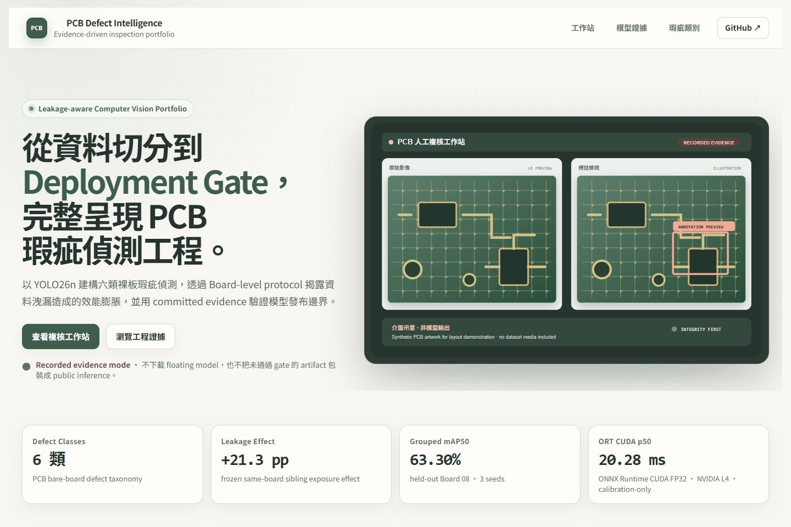
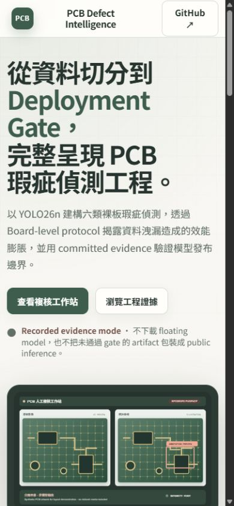
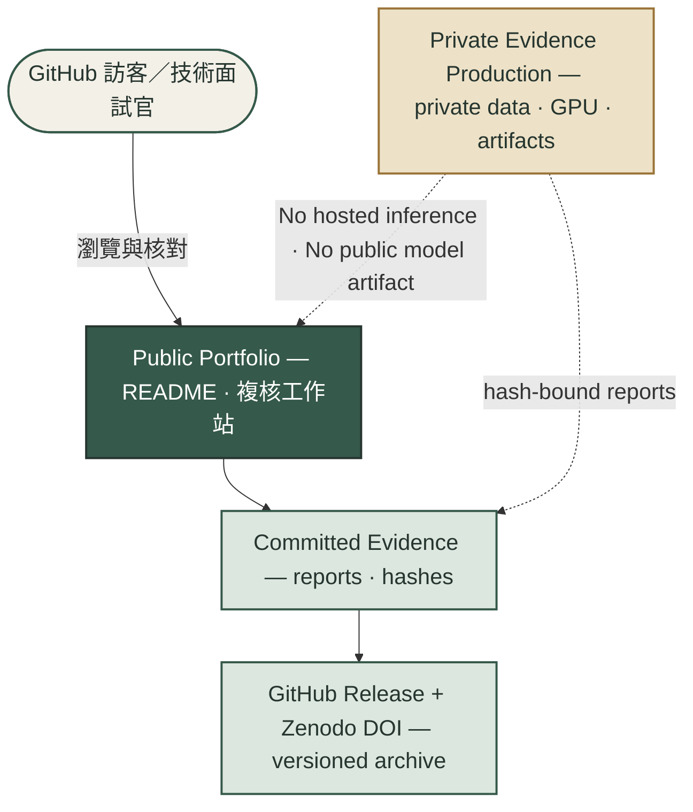
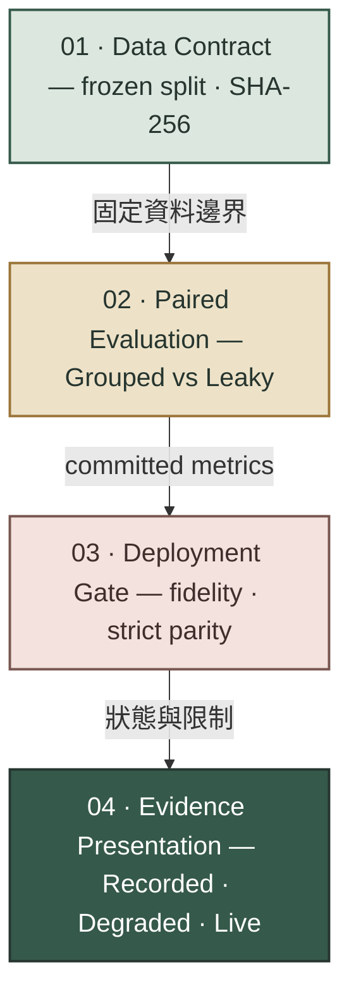
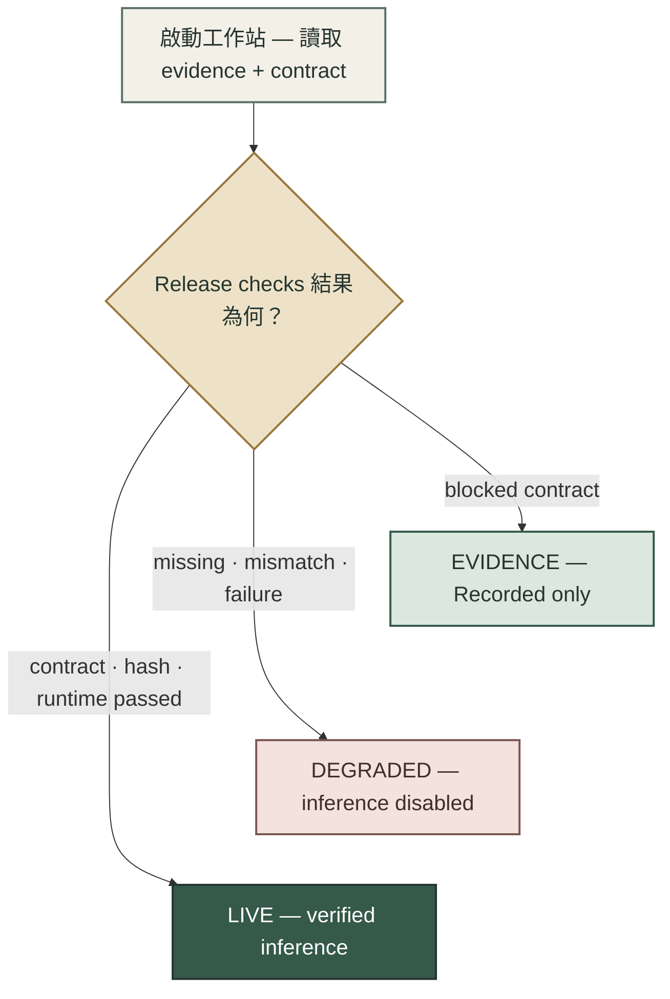
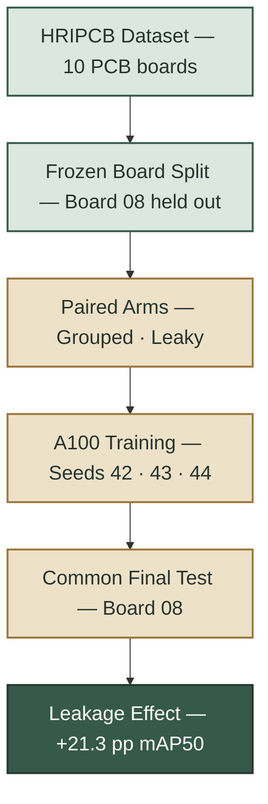
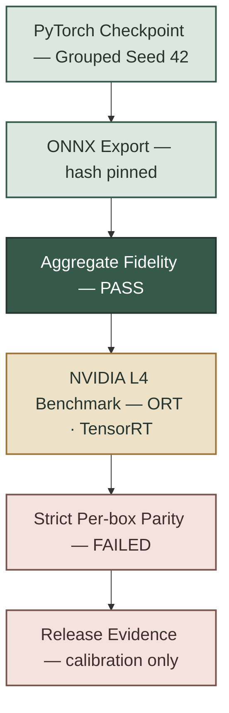

# pcb-defect-detection

[](https://github.com/kuotunyu/pcb-defect-detection/actions/workflows/ci.yml)
[](https://doi.org/10.5281/zenodo.21877496)


[](LICENSE)

## PCB 人工複核工作站



新版 UI 把模型、評估與發布狀態整合為 **PCB 人工複核工作站**。目前以 **Recorded evidence** 模式呈現 committed metrics 與介面示意，不宣稱提供 hosted inference。

- **影像複核視角**：原圖／標註檢視並排，保留 confidence、latency 與複核摘要的產品結構。
- **Evidence-first**：`+21.3 pp` leakage effect、`63.30%` grouped mAP50 與 `20.28 ms` L4 calibration latency 皆直接來自 committed reports。
- **Fail closed**：aggregate fidelity 通過但 strict per-box parity failed；UI 保留完整作品集內容，但不解鎖未通過 contract 的 inference。

### 本機啟動

```powershell
uv run --locked --no-editable --extra app python -m app.app
```

<details>
<summary>Windows 中文路徑注意事項</summary>

- Python 3.11 在 CP950 locale 下可能無法解析 editable-install `.pth` 的中文字路徑。
- 建議 clone 到純 ASCII 路徑，並沿用 `--no-editable`；CI 也採 non-editable install。

</details>

目前啟動後會進入 Recorded evidence mode。未來只有在 `model_contract.json` 宣告 `passed`、artifact SHA-256 相符且 ONNX session 建立成功時，才會顯示上傳與 `執行偵測` 控制項。

<details>
<summary>Mobile layout</summary>



</details>

---

## 三個核心結論

| 結論 | Committed evidence |
|---|---|
| **防洩漏評測** | Grouped mAP50 `63.30%`；same-board sibling exposure 對應 `+21.3 pp`；六板複驗 6/6 為正，平均 `+12.8 pp` |
| **部署速度** | NVIDIA L4 calibration 上，ONNX Runtime CUDA FP32 p50 `20.28 ms` |
| **發布邊界** | Aggregate fidelity 通過；strict per-box parity failed，因此維持 Recorded evidence。修正後重跑：ORT 60/60 通過，TensorRT FP16 1/60 未通過 |

## 系統全貌與證據邊界

公開 repository 提供可閱讀、可核對的作品集與 committed evidence；受授權資料、模型 artifacts 與 GPU 執行環境維持在 private evidence-production boundary。兩者只透過 hash-bound reports 與版本化 metadata 連接。



## 30 秒證據索引

| 招募者要核對的內容 | Committed evidence |
|---|---|
| Same-board exposure 的 paired effect（3 seeds、共同 final test） | [`reports/paired_a100/final_metrics.json`](reports/paired_a100/final_metrics.json) |
| Frozen split、board policy 與 dataset fingerprint | [`reports/protocol/paired_split_manifest.json`](reports/protocol/paired_split_manifest.json) |
| Hash-pinned ONNX fidelity 與 standalone parity gate | [`reports/paired_a100/deployment_gate.public.json`](reports/paired_a100/deployment_gate.public.json) |
| NVIDIA L4 latency、raw timings、fidelity 與 strict parity | [`reports/benchmark_l4.json`](reports/benchmark_l4.json) · [`reports/benchmark_l4_raw.json`](reports/benchmark_l4_raw.json) · [`reports/backend_parity_l4.json`](reports/backend_parity_l4.json) · [`reports/benchmark_l4.md`](reports/benchmark_l4.md) |
| Strict parity 失敗的根因診斷與修正後 L4 重跑 | [`reports/diagnostics/backend_parity_root_cause_2026-09-11.md`](reports/diagnostics/backend_parity_root_cause_2026-09-11.md) · [`reports/l4_rerun_2abe78fe2b54/`](reports/l4_rerun_2abe78fe2b54/README.md) |
| 六塊 held-out board 的預登記複驗 | [`docs/lobo-preregistration.md`](docs/lobo-preregistration.md) · [`reports/lobo/README.md`](reports/lobo/README.md) · [`reports/lobo/summary.json`](reports/lobo/summary.json) |

---

## Evidence-first 系統架構

每一層都輸出下一層可驗證的 contract。Failed gate 會被保留為 evidence，不會被包裝成已發布模型。



| Stage | 核心證據 |
|---|---|
| **01 · Data Contract** | Board ID 隔離 Train／Test，避免 sibling images 跨 split |
| **02 · Paired Evaluation** | 三個 seeds 共用 Board 08 final test，差距 `+21.3 pp` mAP50；六板複驗平均 `+12.8 pp`，範圍 `+1.8` 到 `+21.3` |
| **03 · Deployment Gate** | Aggregate fidelity 通過；frozen strict per-box parity failed。修正 runner 後重跑，ORT 通過、TensorRT FP16 差 1 個門檻邊緣的框 |
| **04 · Evidence Presentation** | 依 contract 顯示 Recorded、Degraded 或 Live 狀態 |

> `60/60` **Same-ONNX wrapper parity** 比較同一 ONNX artifact 的兩條執行路徑，**非 PyTorch reference**。

---

## Fail-closed 工作站啟動時序

工作站先驗證 committed evidence 與 release contract。任何 evidence、hash 或 runtime 失敗都會隱藏 inference controls，並顯示 Recorded evidence 或 Degraded state。



> 目前 committed `model_contract.json` 為 blocked，因此公開作品集停在 **Recorded evidence mode**；上圖的 `LIVE` 是程式中的受控能力路徑，不是已上線服務。

---

## Deep Dive：實驗與部署 Pipeline

<details>
<summary>展開：PCB 板級防洩漏與成對實驗流程</summary>

這張圖展開 frozen Board-level split、Grouped／Leaky Control paired training，以及共同 Board 08 final test 上的受控差值評測。



- **Frozen split**：Grouped train 513 張且排除 Board 08；Leaky Control 以 30 張同板 sibling images 進行對照。
- **共同評測**：三個 seeds 共用 Board 08 final test；`Leaky - grouped: +21.3 pp`，paired F1 delta 為 `0.2546`。
- **統計邊界**：bootstrap resampling unit 是 image，不估計 between-board uncertainty。

</details>

<details>
<summary>展開：ONNX fidelity 與 NVIDIA L4 多後端部署管線</summary>

這張圖展開 PyTorch→ONNX fidelity、TensorRT build、NVIDIA L4 calibration latency 與 strict per-box parity gate。



- **Aggregate fidelity**：Same-ONNX wrapper parity 為 `60/60`，但這不是 PyTorch reference equivalence。
- **L4 latency**：ONNX Runtime CUDA FP32 `p50: 20.28 ms · 49.32 FPS`；TensorRT FP16 p50 為 `51.12 ms`。
- **發布邊界**：PyTorch-reference strict per-box parity gate failed，因此只發布 calibration-only evidence，不宣稱 production SLA。

</details>

---

## 凍結實驗資料分割設計

| 資料集切分 (Partition) | 影像數量 (Images) | 板號防洩漏原則 (Board Policy) |
|---|---:|---|
| Common Final Test | 30 (5/class) | 鎖定 Board 08；兩組訓練集均排除此 30 張測試影像 |
| Validation | 60 (10/class) | 鎖定 Board 01；供超參數選擇與早停共用 |
| Calibration | 60 (10/class) | 鎖定 Board 01；獨立於驗證與訓練集，專供 ONNX/TensorRT 校準 |
| Grouped Train (無洩漏組) | 513 | 僅使用 Boards 04/05/06/07/09/10/11/12；絕無 Board 08 影像 |
| Leaky-control Train (洩漏對照組) | 513 | 替換 30 張同類別 Board 08 兄弟樣本 (Siblings) 進行對照 |

此分割一經凍結即不再變動，並以雜湊綁定；`configs/paired_protocol.yaml` 的 `frozen_hashes`
與 `reports/protocol/paired_split_manifest.json` 必須逐位元相符：

- Manifest SHA-256：`5996d595f5ce17fabd24e631ce580bbf9932a845f9898078267df8c2522892e5`
- Dataset SHA-256：`8e5f0c880af67019bfc7ab5b08a4e63cc33726c97b5a77a41ebb27ddb3709ed4`

---

## 實驗評測與硬體基準數據

### 1. 成對板級洩漏實驗結果 (A100 GPU, 3 Seeds)


> 42 秒動畫：兩組共用同一份 Board 08 final test，唯一差別是 train 是否換入 30 張 Board 08 siblings。純合成圖形，不含任何 dataset 影像；原始碼與算圖步驟在 [`tools/animations/README.md`](tools/animations/README.md)。

在相同的單一 Board 08（30 張 final-test images）上，三種子平均評測結果呈現以下受控差異：

| 實驗組別 (Experiment Arm) | mAP50 (%) | mAP50-95 (%) | 證據邊界 |
|---|---:|---:|---|
| 嚴格分組組 (Grouped) | 63.30% ± 14.91% | 28.82% ± 6.54% | 單一 held-out Board 08 結果；不代表跨板母體或產線泛化 |
| 洩漏對照組 (Leaky Control) | 84.56% ± 3.75% | 40.08% ± 2.52% | same-board sibling exposure 對照組；在 frozen protocol 下高 +21.3 pp |

**判讀：** 在 frozen protocol 下，Leaky Control 比 Grouped 高 `+21.3 pp` mAP50。

<details>
<summary>展開：成對實驗的統計與原始數值</summary>

- **Paired F1 Delta**：`0.2546`；paired image-bootstrap 95% CI `[0.2102, 0.3005]`。
- **原值**：grouped mAP50 `0.6330 ± 0.1491`；leaky control `0.8456 ± 0.0375`。
- **統計邊界**：Resampling unit 是 image，不是 board；不估計 between-board uncertainty。
- **適用邊界**：僅代表 frozen dataset、training recipe 與單一 Board 08 的 30 張 images，不建立 production generalization。

</details>

#### 多板複驗（leave-one-board-out，2026-09-13）

同一套凍結 protocol、同一份 recipe 與 seeds，只把 held-out board 換成規則允許的每一塊板（每類剛好 10 張、不是 validation board 01、不是舊實驗排除的 04）。分析方法在跑之前先登記在 [`docs/lobo-preregistration.md`](docs/lobo-preregistration.md)，[`reports/lobo/summary.json`](reports/lobo/summary.json) 記錄該文件的 SHA-256。Board 08 沿用上表的已發布結果，其餘五塊板在 Colab A100 各跑 6 個 run。

| Held-out board | Grouped mAP50 | Leaky control mAP50 | Δ mAP50 | Δ mAP50-95 |
|---|---:|---:|---:|---:|
| 05 | `0.6552 ± 0.1000` | `0.8495 ± 0.0450` | `+19.4 pp` | `+9.9 pp` |
| 07 | `0.8509 ± 0.0608` | `0.9186 ± 0.0190` | `+6.8 pp` | `+3.6 pp` |
| 08 | `0.6330 ± 0.1491` | `0.8456 ± 0.0375` | `+21.3 pp` | `+11.3 pp` |
| 09 | `0.7679 ± 0.0524` | `0.8411 ± 0.0413` | `+7.3 pp` | `+5.8 pp` |
| 11 | `0.6813 ± 0.0618` | `0.8809 ± 0.0260` | `+20.0 pp` | `+15.5 pp` |
| 12 | `0.8892 ± 0.0799` | `0.9077 ± 0.0297` | `+1.8 pp` | `+3.2 pp` |

**預登記的結論用語**：same-board sibling exposure 在六塊 held-out board 上都提高了 final-test mAP50，平均 `+12.8 pp`（範圍 `+1.8` 到 `+21.3`，跨板樣本標準差 `8.4 pp`，6/6 為正）。以板為單位重抽樣 10,000 次的 95% 區間為 `+6.5` 到 `+18.3 pp`，n = 6 時只是近似值。效果大小明顯因板而異：grouped 分數越低的板（05、08、11）被墊高越多，本來就高的板（07、12）差距小。

**邊界**：01、04、06、10 四塊板從未被 held out，所以這是「資料集允許的 60 張板」之間的複驗，不是母體估計；每個 fold 仍是單一板的 30 張 final test。每塊板的完整公開 metadata 在 `reports/lobo/boardNN/`，格式與 `reports/paired_a100/` 相同。

### 2. NVIDIA L4 多後端推論延遲評測

> **首次 L4 session · Calibration-only evidence**：下表來自首次 private NVIDIA L4 session，不是 production SLA；repository 不發佈 TensorRT engine、public model 或 public checkpoint。修正 reference 幾何後的 parity 與 timing 另見[修正後 L4 重跑報告](reports/l4_rerun_2abe78fe2b54/README.md)，overall gate 仍為 failed。

測試條件：60 張 calibration images、batch 1、30 次 warmup、4 cycles、interleaved backend order。

| Backend | Precision | p50 (ms) | p95 (ms) | FPS from p50 |
|---|---|---:|---:|---:|
| PyTorch | FP32 | 60.86 | 62.36 | 16.43 |
| ONNX Runtime CUDA | FP32 | 20.28 | 20.87 | 49.32 |
| TensorRT | FP16 | 51.12 | 52.25 | 19.56 |

**ONNX Runtime CUDA FP32 是本次最快後端**；aggregate fidelity 通過，但 strict per-box prediction-parity gate failed。

<details>
<summary>展開：L4 raw values 與 strict parity 細節</summary>

- **Aggregate fidelity**：TensorRT FP16 相對 source checkpoint 的 mAP50-95 差值為 `-0.014537137094089408`，通過 `|Δ| < 0.02`。
- **Raw timings**：TensorRT p50 `51.12191199998506` ms、p95 `52.25180029992771` ms；720 筆 observations 位於 `reports/benchmark_l4_raw.json`。
- **Strict parity**：PyTorch reference 有 95 個 detections；ORT 配對 57 個、漏配 38/5，TensorRT 配對 56 個、漏配 39/5。
- **Gate 結果**：兩個 backend 都有 40/60 images 未通過；門檻在執行前已凍結。完整 evidence 見 `reports/backend_parity_l4.json`。
- **根因診斷（2026-09-11）**：失敗來自 runner 讓 PyTorch reference 走 352×640 矩形 letterbox，而兩個匯出後端固定在 640×640。用同一顆 checkpoint 只切換輸入幾何，就能在本機重現 39/60 的失敗。見 `reports/diagnostics/backend_parity_root_cause_2026-09-11.md`。
- **修正後重跑**：runner 固定為 640×640 後，同一顆 checkpoint、同一組 calibration images 與門檻重跑。ORT CUDA FP32 在 60/60 張圖配對全部 62 個框，min IoU `0.9989`、max Δconf `0.0013`。TensorRT FP16 配對 61/62，1/60 張圖未通過，漏掉的框信心只比 `0.25` 門檻高不到 `0.002`。Gate 要求兩個後端都通過，因此仍為 failed。見 `reports/l4_rerun_2abe78fe2b54/`。

</details>

---

## PCB 六大檢測瑕疵類別

| 瑕疵類別 (Defect Class) | 瑕疵中文說明 | 產線常見成因與影響 |
|---|---|---|
| `missing_hole` | 漏孔 / 缺孔 | 鑽孔製程遺漏，導致後續元件無法插裝貫通 |
| `mouse_bite` | 鼠咬 / 邊緣缺口 | 蝕刻不均或板邊毛邊，可能造成線路阻抗異常 |
| `open_circuit` | 斷路 / 開路 | 銅箔線路斷裂，造成電氣信號無法導通中斷 |
| `short` | 短路 | 殘銅或錫橋相連，導致相鄰線路不正常導通 |
| `spur` | 針狀突出 / 殘銅 | 乾膜破損或蝕刻不全，易引發潛在短路風險 |
| `spurious_copper` | 雜銅 / 假銅斑 | 孤立無效銅渣，影響絕緣耐壓與高頻特性 |

---

## 快速開始

### 1. 安裝環境套件

```bash
# 建立虛擬環境並安裝依賴
uv sync --locked --no-editable

# 執行單元測試與程式碼風格稽核
uv run python -m pytest -v
uv run ruff check .
```

### 2. 資料集下載與防洩漏前處理

```bash
# 下載 HRIPCB 資料集並轉換為 YOLO 格式 (嚴格分組策略)
uv run python -m pcb_defect.data_prep.prepare --out data/pcb --strategy grouped --seed 42

# 驗證凍結分割協定並產生配對資料清單
uv run python -m pcb_defect.data_prep.paired \
  --source data/pcb \
  --config configs/paired_protocol.yaml \
  --artifacts reports/protocol \
  --runtime data/paired
```

### 3. GPU 實驗入口（先檢查 CLI，不會啟動訓練）

```bash
# 顯示所有必要參數；此命令不會下載 dataset、訓練或使用 GPU
uv run --locked --no-editable --extra train --group eval \
  python -m pcb_defect.experiment --help
```

- [A100 paired experiment notebook](notebooks/paired_experiment_a100.ipynb)：可續跑，含 input/hash gates。
- [L4 deployment benchmark notebook](notebooks/deployment_benchmark_l4.ipynb)：需明確提供 dataset 與 workspace 路徑。

README 只提供安全的 CLI 檢查入口，不提供會誤啟動訓練的裸命令。

---

## 專案結構

| 檔案 / 目錄 | 功能說明與職責 |
|---|---|
| `configs/paired_protocol.yaml` | 成對實驗資料分割與訓練超參數協定 |
| `configs/base_model.yaml` | YOLO26n 基礎模型下載與 SHA-256 驗證組態 |
| `configs/lobo/` · `docs/lobo-preregistration.md` · `reports/lobo/` | 多板複驗（leave-one-board-out）的 fold 註冊表、預登記分析與六板結果 |
| `src/pcb_defect/data_prep/paired.py` | HRIPCB 成對板級防洩漏資料準備 |
| `src/pcb_defect/experiment.py` | A100 訓練執行、斷點續跑門控與自動重試管理 |
| `src/pcb_defect/final_evaluation.py` | 單次一擊 (One-shot) 最終測試集評測 |
| `src/pcb_defect/benchmark.py` · `src/pcb_defect/deployment.py` | L4 多後端 benchmark、strict parity gate 與 export／deployment gate |
| `notebooks/` | Colab 用的 A100 成對實驗、parity probe、L4 benchmark 與多板複驗 notebooks |
| `app/` | 正體中文 PCB 人工複核工作站（Gradio），預設只讀取 committed evidence |
| `reports/protocol/` | 凍結分割 Manifest 與配對哈希驗證紀錄 |
| `reports/paired_a100/` · `reports/claims.yaml` | Board 08 成對實驗的公開 metadata 與 claim registry |
| `reports/benchmark_l4.md` | Verified NVIDIA L4 latency、aggregate fidelity 與 failed strict parity 摘要 |
| `reports/diagnostics/` · `reports/l4_rerun_2abe78fe2b54/` · `scripts/diagnostics/` | Strict parity 根因診斷、修正後 L4 重跑證據與機制驗證腳本 |
| `docs/model-card.md` · `docs/data-card.md` · `docs/limitations.md` · `docs/license-boundary.md` | Model card、資料卡、限制與授權邊界 |
| `docs/releases/` · `docs/release-checklist.md` · `docs/research-package.md` | 各版本 release notes、發布紀錄與 research package 說明 |
| `tools/animations/` | README 解說動畫的 Manim 原始碼與算圖說明；不進鎖定依賴與 CI |
| `tests/` | CPU-only 契約測試：protocol、claims、README 數字、notebooks 與 release metadata |

---

## 引用

目前軟體版本為 **v0.3.0**，已由 Zenodo 永久典藏：

- 版本 DOI：[`10.5281/zenodo.22736483`](https://doi.org/10.5281/zenodo.22736483)
- 全版本 DOI：[`10.5281/zenodo.21877496`](https://doi.org/10.5281/zenodo.21877496)

既有版本仍以不可變版本 DOI 保存：

- **v0.2.0** 版本 DOI：[`10.5281/zenodo.21912370`](https://doi.org/10.5281/zenodo.21912370)
- **v0.1.0** 版本 DOI：[`10.5281/zenodo.21877497`](https://doi.org/10.5281/zenodo.21877497)

引用目前版本時請使用：

> kuotunyu. (2026). *PCB Defect Detection: Leakage-Aware Evaluation and Deployment Evidence* (Version 0.3.0) [Computer software]. Zenodo. https://doi.org/10.5281/zenodo.22736483

引用歷史 `v0.2.0` 時請使用：

> kuotunyu. (2026). *PCB Defect Detection: Leakage-Aware Evaluation and Deployment Evidence* (Version 0.2.0) [Computer software]. Zenodo. https://doi.org/10.5281/zenodo.21912370

引用歷史 `v0.1.0` 時請使用：

> kuotunyu. (2026). *PCB Defect Detection: Leakage-Aware Evaluation and Deployment Evidence* (Version 0.1.0) [Computer software]. Zenodo. https://doi.org/10.5281/zenodo.21877497

機器可讀的引用資料請見 [`CITATION.cff`](CITATION.cff)。

---

## 授權與聲明

本專案原創程式碼採 [AGPL-3.0-or-later](LICENSE)。此 code license 不授予 HRIPCB 原始影像、標註、base weights、derived weights 或 exports 的再散佈權；詳見 [`docs/license-boundary.md`](docs/license-boundary.md)。
