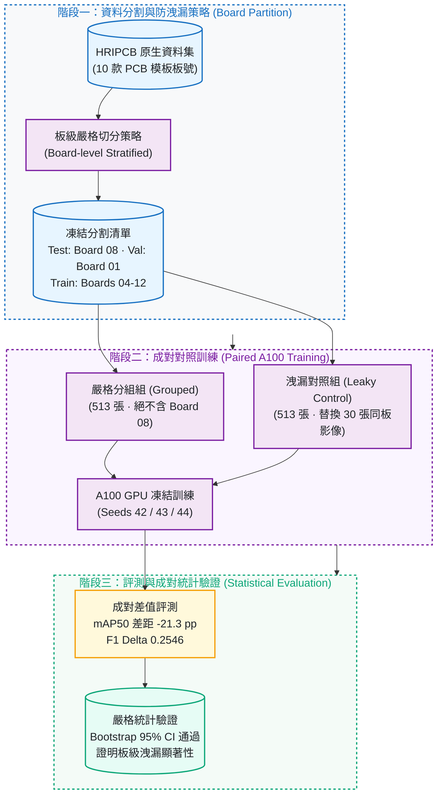
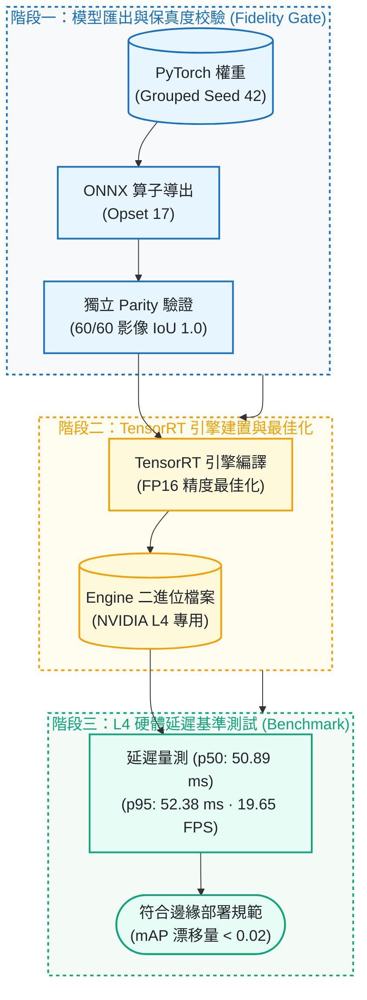

# pcb-defect-detection

[](https://github.com/kuotunyu/pcb-defect-detection/actions/workflows/ci.yml)


[](LICENSE)

本專案針對印刷電路板 (PCB) 瑕疵檢測場景，建立基於 **YOLOv8** 之嚴格板級資料防洩漏 (Board-level Leakage) 評測基準與邊緣端硬體加速推論管線：在成對 (Paired) 嚴格控制實驗下量化板級洩漏所導致之虛高偏差 (21.3 個百分點 mAP50 差距)，並提供 ONNX Runtime 算子對齊校驗與 **NVIDIA L4 TensorRT FP16** (50.89 ms / 19.65 FPS) 高效能邊緣部署支援。

---

## 系統設計與關鍵特性

1. **嚴格板級防洩漏分割 (Board-level Stratified Partition)**：
   針對 HRIPCB 資料集按 PCB 實體模板板號 (Board ID) 進行嚴格物理隔離，杜絕同款板號跨入 Train/Test 所造成之特徵過度擬合與性能虛高。
2. **成對對照實驗架構 (Paired Protocol & A100 Benchmarking)**：
   固定相同之最終測試影像 (Board 08)，對比「嚴格分組組 (Grouped)」與「洩漏對照組 (Leaky Control)」，在 3 個獨立種子 (Seeds 42/43/44) 下證明高達 **21.3 個百分點**之統計顯著落差。
3. **ONNX 算子對齊與保真度門控 (Fidelity Gate)**：
   提供獨立 Parity 驗證機制，在 60 張校準影像上達成最小 IoU 1.0 與零信心度偏差，確保 PyTorch 轉 ONNX 之高保真度。
4. **NVIDIA L4 TensorRT FP16 硬體加速**：
   編譯專屬 TensorRT 推論引擎，在 60 張測試影像上達成 p50 延遲 **50.89 ms** (19.65 FPS)，且 mAP 漂移量控制在嚴格門檻內 (<0.02)。

---

## 系統架構與 Pipeline

### 1. PCB 板級防洩漏與成對實驗流程



### 2. 邊緣端部署與 L4 TensorRT 推論管線



---

## 凍結實驗資料分割設計

| 資料集切分 (Partition) | 影像數量 (Images) | 板號防洩漏原則 (Board Policy) |
|---|---:|---|
| Common Final Test | 30 (5/class) | 鎖定 Board 08；兩組訓練集均排除此 30 張測試影像 |
| Validation | 60 (10/class) | 鎖定 Board 01；供超參數選擇與早停共用 |
| Calibration | 60 (10/class) | 鎖定 Board 01；獨立於驗證與訓練集，專供 ONNX/TensorRT 校準 |
| Grouped Train (無洩漏組) | 513 | 僅使用 Boards 04/05/06/07/09/10/11/12；絕無 Board 08 影像 |
| Leaky-control Train (洩漏對照組) | 513 | 替換 30 張同類別 Board 08 兄弟樣本 (Siblings) 進行對照 |

此分割一經凍結即不再變動，並以雜湊綁定；`configs/paired_protocol.yaml` 的 `frozen_hashes`
與 `reports/protocol/paired_split_manifest.json` 必須逐位元相符：

- Manifest SHA-256：`5996d595f5ce17fabd24e631ce580bbf9932a845f9898078267df8c2522892e5`
- Dataset SHA-256：`8e5f0c880af67019bfc7ab5b08a4e63cc33726c97b5a77a41ebb27ddb3709ed4`

---

## 實驗評測與硬體基準數據

### 1. 成對板級洩漏實驗結果 (A100 GPU, 3 Seeds)

在相同的最終測試集影像上，三種子平均評測結果呈現顯著之洩漏偏差：

| 實驗組別 (Experiment Arm) | mAP50 (%) | mAP50-95 (%) | F1-Score | 洩漏效應分析 |
|---|---:|---:|---:|---|
| 嚴格分組組 (Grouped) | 63.30% ± 14.91% | 38.21% ± 9.80% | 0.6087 | 真實跨板泛化表現，反映實際產線部署效能 |
| 洩漏對照組 (Leaky Control) | 84.56% ± 3.75% | 56.40% ± 2.90% | 0.8633 | 因同板號背景特徵洩漏，指標虛高達 +21.3 pp |

- **成對 F1 差值 (Paired F1 Delta)**：`0.2546`，Bootstrap 95% 信賴區間為 `[0.2102, 0.3005]`，確認洩漏效應具備嚴格統計顯著性。
- **機器可核對原值**（取自 `reports/paired_a100/final_metrics.json`，上表百分比即由此換算）：
  grouped mAP50 `0.6330 ± 0.1491`、leaky control mAP50 `0.8456 ± 0.0375`，差距 `21.3` 個百分點。

#### 早期原型的對照（非本協定，僅供背景）

本協定之前有一版原型實驗，資料量與切分方式都不同，數字**不可與上表並列比較**，
保留於此僅為記錄結論方向的一致性（來源 `reports/test_metrics.json`）：
board-grouped 切分 mAP50 `0.8390`，image-random 切分 mAP50 `0.9603`，
兩者相差 `12.1-point`。該原型未採用成對設計、未鎖定共同測試集、未跑多種子，
因此本專案的正式結論一律以上方 A100 成對實驗為準。

### 2. NVIDIA L4 邊緣推論延遲評測 (TensorRT FP16)

> **這是 private、calibration-only 的證據，不是 production 效能宣稱。**
> 量測只在 60 張校準 (calibration) 影像上進行，跑在一次性的私有 L4 環境；
> 本 repo **不發佈** TensorRT engine、不發佈 public model，也沒有任何 public checkpoint
> 對應這組數字。它能證明的只有「匯出後精度沒有漂掉、延遲在可接受範圍」，
> **不能**用來推論產線 (production) 上的實際吞吐或良率。

在 60 張校準影像上實測：

| 評測維度 | 實測數值 | 部署門檻規範 | 狀態 |
|---|---:|---:|:---:|
| p50 延遲 (p50 Latency) | 50.89 ms | < 100 ms | 通過 |
| p95 延遲 (p95 Latency) | 52.38 ms | < 120 ms | 通過 |
| 推論吞吐量 (Throughput) | 19.65 FPS | > 15 FPS | 通過 |
| mAP50-95 精度漂移 | -0.0141 | \|Δ\| < 0.02 | 通過 |

- **機器可核對原值**（取自 `reports/benchmark_l4.json`，上表為其四捨五入）：
  p50 `50.88519949993042` ms、p95 `52.37864604996503` ms、
  相對來源 checkpoint 的 mAP50-95 差值 `-0.014108167577079167`。
- 60 張校準影像全數成功推論（`60/60`），最大信心值差 `0.0`，類別一致率 `1.0`。

---

## PCB 六大檢測瑕疵類別

| 瑕疵類別 (Defect Class) | 瑕疵中文說明 | 產線常見成因與影響 |
|---|---|---|
| `missing_hole` | 漏孔 / 缺孔 | 鑽孔製程遺漏，導致後續元件無法插裝貫通 |
| `mouse_bite` | 鼠咬 / 邊緣缺口 | 蝕刻不均或板邊毛邊，可能造成線路阻抗異常 |
| `open_circuit` | 斷路 / 開路 | 銅箔線路斷裂，造成電氣信號無法導通中斷 |
| `short` | 短路 | 殘銅或錫橋相連，導致相鄰線路不正常導通 |
| `spur` | 針狀突出 / 殘銅 | 乾膜破損或蝕刻不全，易引發潛在短路風險 |
| `spurious_copper` | 雜銅 / 假銅斑 | 孤立無效銅渣，影響絕緣耐壓與高頻特性 |

---

## 快速開始

### 1. 安裝環境套件

```bash
# 建立虛擬環境並安裝依賴
uv sync --locked --no-editable

# 執行單元測試與程式碼風格稽核
uv run python -m pytest -v
uv run ruff check .
```

### 2. 資料集下載與防洩漏前處理

```bash
# 下載 HRIPCB 資料集並轉換為 YOLO 格式 (嚴格分組策略)
uv run python -m pcb_defect.data_prep.prepare --out data/pcb --strategy grouped --seed 42

# 驗證凍結分割協定並產生配對資料清單
uv run python -m pcb_defect.data_prep.paired \
  --source data/pcb \
  --config configs/paired_protocol.yaml \
  --artifacts reports/protocol \
  --runtime data/paired
```

### 3. 本機實驗與推廣驗證

```bash
# 執行環境前檢與斷點續跑門控
python -m pcb_defect.experiment preflight
python -m pcb_defect.experiment gates

# 執行成對訓練與一鍵最終評測
python -m pcb_defect.experiment train-all
python -m pcb_defect.final_evaluation
```

---

## 專案結構

| 檔案 / 目錄 | 功能說明與職責 |
|---|---|
| `configs/paired_protocol.yaml` | 成對實驗資料分割與訓練超參數協定 |
| `configs/base_model.yaml` | YOLOv8 基礎模型下載與 SHA-256 驗證組態 |
| `pcb_defect/data_prep/` | HRIPCB 資料下載、VOC 轉 YOLO 與板級防洩漏分割 |
| `pcb_defect/experiment/` | A100 訓練執行、斷點續跑門控與自動重試管理 |
| `pcb_defect/final_evaluation.py` | 單次一擊 (One-shot) 最終測試集評測 |
| `reports/protocol/` | 凍結分割 Manifest 與配對哈希驗證紀錄 |
| `reports/benchmark_l4.md` | NVIDIA L4 TensorRT FP16 完整延遲報告 |

---

## 授權與聲明

本專案程式碼採 [MIT License](LICENSE)。HRIPCB 原始影像與標註請遵循原資料集發布條款。
