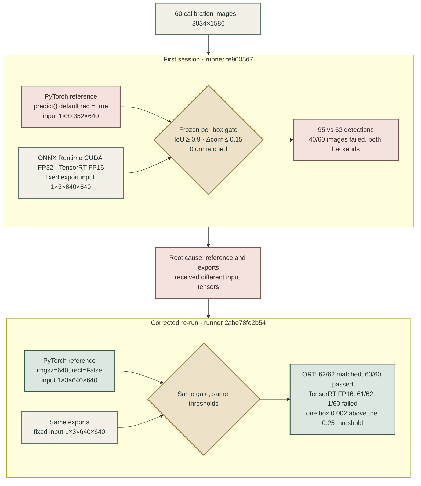

# Backend prediction parity: root-cause diagnosis (2026-09-11)

Scope: the failed strict per-box PyTorch-reference parity gate recorded in
[`reports/backend_parity_l4.json`](../backend_parity_l4.json), where ONNX Runtime CUDA FP32 and
TensorRT FP16 each failed 40/60 calibration images. This document records what was verified, what
was ruled out, the corrected re-run, what remains unverified, and where to stop. It does not alter
any historical report, threshold, model, or result.

Chronology: the diagnosis and runner fix were made first (source commits `390ff4b` and
`1e7e614`); the corrected L4 re-run followed the same day from source commit `c247603` (runner
snapshot `2abe78fe2b54`). The re-run confirmed the diagnosis.

## Conclusion

The first-session failure came from an **input-geometry mismatch inside the parity harness**, not
from ONNX export loss, ONNX Runtime, TensorRT, or FP16 precision.

- The L4 runner (`src/pcb_defect/benchmark.py`) called Ultralytics `predict()` on the PyTorch
  checkpoint with library defaults. In Ultralytics 8.4.89, `Model.predict()` injects `rect=True`
  (`engine/model.py:528`), and `BasePredictor.pre_transform()` enables the minimal-rectangle
  letterbox only for `format == "pt"` (`engine/predictor.py:197-203`, `LetterBox(auto=True)`,
  `data/augment.py:120-121`).
- Every calibration image is 3034x1586. Under `auto=True` the PyTorch reference received a
  **1x3x352x640** tensor (17 padding rows); the ONNX export, the TensorRT engine, and the
  standalone runtime are fixed at **1x3x640x640** (305 padding rows). Resize ratio and resized
  content are identical; only the padding extent, and therefore the feature-map grid and border
  context, differ. In the rectangular geometry the reference emitted 95 detections; in the export
  geometry it emits 62.
- After pinning the reference to 640x640, the corrected L4 re-run shows ONNX Runtime CUDA FP32
  matching every PyTorch detection on all 60 images. TensorRT FP16 misses exactly one detection
  that sits at the confidence threshold. The frozen gate therefore still fails, now for a
  narrow and explained reason.

The two sessions differ in exactly one place, the tensor handed to the PyTorch reference:



## Corrected L4 re-run (runner `2abe78fe2b54`)

Same checkpoint, ONNX, calibration images, thresholds, evaluator, and L4 software stack as the
first session; only the reference input geometry changed. Full public metadata:
[`reports/l4_rerun_2abe78fe2b54/`](../l4_rerun_2abe78fe2b54/README.md).

| Candidate vs PyTorch FP32 | Ref / cand / matched | Unmatched ref / cand | Min IoU | Max conf delta | Failed images |
|---|---:|---:|---:|---:|---:|
| First session, ORT CUDA FP32 | 95 / 62 / 57 | 38 / 5 | 0.8410 | 0.1984 | 40 / 60 |
| First session, TensorRT FP16 | 95 / 61 / 56 | 39 / 5 | 0.8451 | 0.1961 | 40 / 60 |
| **Re-run, ORT CUDA FP32** | 62 / 62 / 62 | 0 / 0 | 0.9989 | 0.0013 | **0 / 60** |
| **Re-run, TensorRT FP16** | 62 / 61 / 61 | 1 / 0 | 0.9585 | 0.0077 | **1 / 60** |

Both candidates produced the same number of detections in both sessions (62 and 61); only the
reference changed. That is the direct signature of a reference-side defect.

**The one remaining TensorRT FP16 failure** is on `image_028`. The unmatched reference detection
had a confidence less than `0.002` above the `0.25` threshold. ONNX Runtime kept it. TensorRT FP16
confidence deviations on the 61 matched detections ranged from `-0.0042` to `+0.0077`, so a drop
below the threshold is well within its observed FP16 noise. The candidate's sub-threshold score is
filtered out before recording, so this is an inference, not a measurement. It is a property of
FP16 precision combined with a hard confidence threshold and a zero-unmatched rule, not an
implementation defect, and it must not be "fixed" by changing the frozen gate.

## Local reproduction with the recorded checkpoint

The private re-run package contains the recorded checkpoint (`44646b13…`) and ONNX export
(`b62590a1…`). Using those exact bytes on an RTX 4090 with the locked Ultralytics 8.4.89 /
torch 2.12.1+cu126 / ONNX Runtime 1.26.0 stack (ORT on the CPU provider), the first-session failure
is reproduced by the geometry switch alone and disappears when geometry matches.
Evidence: [`backend_parity_mechanism_check_l4_checkpoint_2026-09-11.json`](backend_parity_mechanism_check_l4_checkpoint_2026-09-11.json).

| Comparison (frozen evaluator and thresholds) | Ref / cand / matched | Min IoU | Max delta | Failed |
|---|---:|---:|---:|---:|
| A: PyTorch default `predict()` (observed 1x3x352x640) vs C: standalone ORT 640x640 | 94 / 62 / 57 | 0.8409 | 0.1971 | 39 / 60 |
| A vs B: same weights, `predict(rect=False)` (observed 1x3x640x640) | 94 / 62 / 57 | 0.8407 | 0.1983 | 39 / 60 |
| B vs C: same geometry | 62 / 62 / 62 | 0.9987 | 0.0027 | 0 / 60 |
| D: corrected runner helper vs C | 62 / 62 / 62 | 0.9987 | 0.0027 | 0 / 60 |
| D vs B | 62 / 62 / 62 | 1.0000 | 0.0000 | 0 / 60 |

Row A reproduces the L4 first session within one borderline detection (L4: 95 / 62 / 57, 40 / 60).
An earlier check with a local July prototype pair showed the same mechanism
([`backend_parity_mechanism_check_2026-09-11.json`](backend_parity_mechanism_check_2026-09-11.json)).

## Other verified facts

1. **Artifact identity is consistent.** Both L4 sessions, `deployment_gate.public.json`, and the
   package manifests bind the same checkpoint and ONNX; `verify_l4_inputs` hash-checks both before
   each run. `configs/backend_parity.yaml` and `configs/deployment_gate.yaml` hash to the recorded
   `config_sha256` values (`ef05243a…`, `1c279957…`).
2. **Calibration inputs are identical across sessions**: the image-list and image-content hashes
   match, and all 60 local copies match the protocol manifest.
3. **The standalone path matches Ultralytics' non-PT path** (historical same-ONNX gate: 60/60, IoU
   1.0, delta 0.0), and `scale_boxes` uses the same `round(pad - 0.1)` convention as
   `e2e_onnx.postprocess`.
4. **Head semantics agree**: the YOLO26 end2end head emits `(1, 300, 6)` xyxy rows; Ultralytics
   applies only a confidence filter for end2end models (`utils/nms.py:54-55`), as does
   `e2e_onnx.postprocess`.

## Hypotheses ruled out

- Wrong or mismatched source model or export: excluded by hash bindings.
- Resize, colour, or normalisation differences: excluded by the same-ONNX gate and identical
  resize ratio and resized pixels in both geometries.
- Coordinate inversion or confidence-filter bugs: excluded by B vs C and the re-run ORT result.
- An ONNX Runtime or export defect: the re-run ORT result is 62/62 on 60/60 images.
- An evaluator defect: the same evaluator returns 60/60 whenever geometry matches.

## Fix applied

`src/pcb_defect/benchmark.py` pins every Ultralytics-driven inference to
`ULTRALYTICS_INPUT_CONTRACT = {"imgsz": 640, "rect": False}`. Thresholds, the evaluator, the
report schema, and the standalone ONNX path are unchanged. Regression tests in
`tests/test_benchmark.py` fail against the previous runner and pass with the fix.

## Still unverified

- The TensorRT FP16 score for the single missing detection is not recorded; the threshold-crossing
  explanation rests on the observed FP16 deviation range.
- The first-session runner commit `fe9005d7` is not in the public history; its behavioural
  equivalence to the pre-fix runner rests on config hashes and the recorded protocol scope.
- The A100 aggregate fidelity gate (`deployment.py::_validate_model`) has the same asymmetry:
  `Model.val()` defaults to `rect=True` for `.pt`, while the validator forces `rect=False` for
  non-PT formats (`engine/validator.py:213-214`). The recorded `-0.0128` / `-0.0145` mAP50-95
  deltas therefore include a geometry component. This was not re-measured; the gate passed and is
  left untouched.

## Minor observations (not changed)

- The first session's PyTorch timing was measured on a 352x640 input. The re-run p50 on 640x640
  differs by less than 0.2 ms, so the published timing comparison was not materially affected.
- `e2e_onnx.postprocess` keeps rows with `score >= conf`, while Ultralytics keeps `score > conf`.
  This matters only at exactly `0.25` and did not contribute here.

## Reproduction

Static geometry (pure Python, mirrors `ultralytics/data/augment.py::LetterBox`):
3034x1586 -> ratio 0.21094 -> resized 640x335 -> `auto=True` pads 8/9 rows (352x640),
`auto=False` pads 152/153 rows (640x640).

Regression tests:

```bash
uv run --locked --extra app pytest tests/test_benchmark.py -k input_contract -q
```

Mechanism check (requires the locked train+eval environment, a checkpoint/ONNX pair, and the
converted dataset; run from the repository root):

```bash
uv run --locked --extra train --group eval python scripts/diagnostics/backend_parity_mechanism_check.py --repo . --pt <checkpoint.pt> --onnx <export.onnx> --out <output.json> --device 0 --purpose "<which pair was used>"
```

The corrected L4 re-run used the standard handoff flow (`python -m pcb_defect.l4_handoff`) from
source commit `c247603`, followed by `pcb_defect.l4_evidence.promote_l4_package` on the returned
package.

## Recommendation and stopping point

Stop here. The first-session failure has a checkable, reproduced explanation; the runner defect is
fixed with regression coverage; and the corrected re-run shows per-box equivalence for ONNX Runtime
CUDA FP32 on the calibration split. The frozen gate still fails because of one TensorRT FP16
detection at the confidence threshold, and that result stands.

Further work would be a new, pre-registered protocol rather than part of this investigation, and
is only worth it if TensorRT FP16 becomes a deployment requirement. Options would be an FP32
TensorRT engine, or a gate that treats detections within a declared band around the confidence
threshold explicitly. Neither should be applied retroactively to these results.
